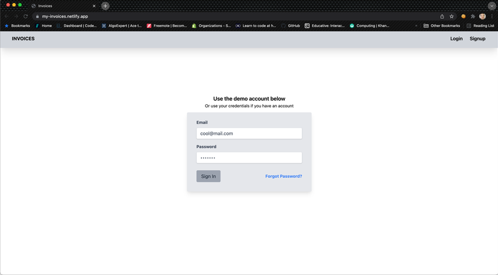
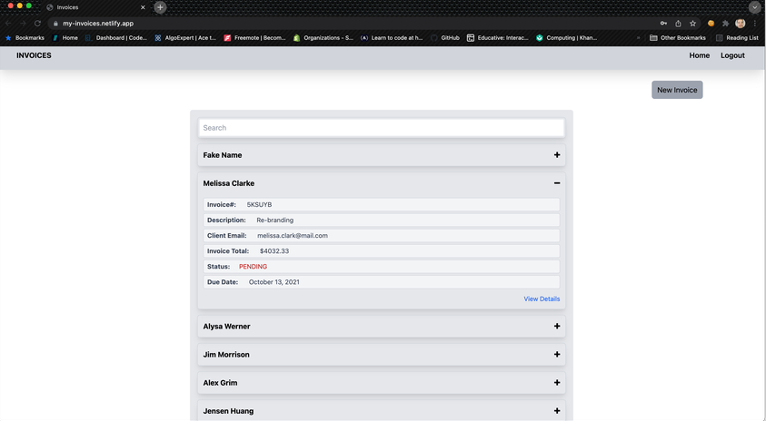
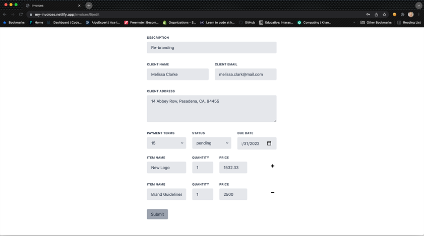

# Invoices Backend
This application creates and manages Invoices for an account.

Here is the link to the [_Frontend_](https://github.com/iamme24cl/invoices-frontend). Demo Video hosted [_here_](https://www.loom.com/share/4c4f5df831e14e61827c769807e2b9e4?sharedAppSource=personal_library).

## Table of Contents
* [General Info](#general-information)
* [Technologies Used](#technologies-used)
* [Usage](#usage)
* [Contact](#contact)


## General Information
- Create, update and delete invoices.
- Easily manage invoicing your Clients
- The following is an example json response expected from this api
```
invoice_data = [
  {
    payment_due: "2021-08-19",
    description: "Re-branding",
    payment_terms: 15,
    status: "pending",
    client_name: "Jensen Huang",
    client_email: "jensenh@mail.com",
    client_address: "106 Kendell Street, Sharrington, NR24 5WQ, United Kingdom",
    items: [
      {
        name: "Brand Guidelines",
        price: 1800.00,
        quantity: 1
      },
      {
        name: "New Logo",
        price: 1532.33,
        quantity: 1
      },
      {
        name: "Social Medial Consulting",
        price: 2500.00,
        quantity: 1
      }
    ],
  },
  {
    payment_due: "2021-09-20",
    description: "Graphic Design",
    payment_terms: 30,
    status: "pending",
    client_name: "Alex Grim",
    client_email: "alexfrim@mail.com",
    client_address: "19 Union Terrace, London, E1 3EZ, United Kingdom",
    items: [
      {
        name: "Banner Design",
        price: 156.00,
        quantity: 1
      },
      {
        name: "Email Design",
        price: 200.00,
        quantity: 2
      }
    ],
    [
      {
        name: "Webiste Redisgn",
        price: 14002.33,
        quantity: 1
      }
    ],
  },
 ]
```

## Technologies Used
Ruby on Rails, PostgreSQL

## Usage
* Clone this backend repository to your machine  https://github.com/iamme24cl/invoices-backend
* Run `bundle` to install all gems listed in the gemfile
* Run `rails db:create && db:migrate` to create and migrate the database (If you are on a windows machine, you will need to make sure your PostgreSQL server is running. You can easily manage this in the PGAdmin desktop application.)
* Run `rails s` to run the server
* On the  [_frontend_](https://github.com/iamme24cl/invoices-frontend) folder run `npm install && npm start` to install all dependecies listed in the package.json file and start the server and run the application in the browser.

---
##### Login Page

--
##### Home Page

--
##### Filter Invoices

--
##### Filter Invoices

--
##### Invoice Form with dynamically generated and removed form fields for items

--
##### Invoice Page

--
##### Download as PDF

--
##### Print Page

--


## Contact
Created by [@iamme24cl](https://github.com/iamme24cl) - feel free to contact me!


